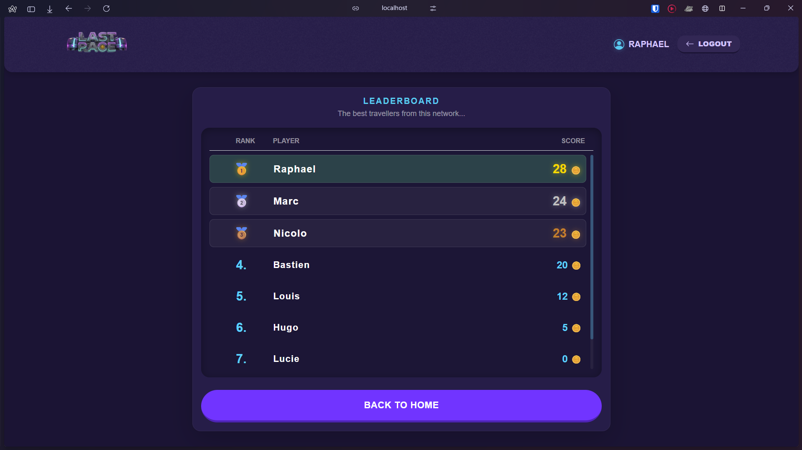
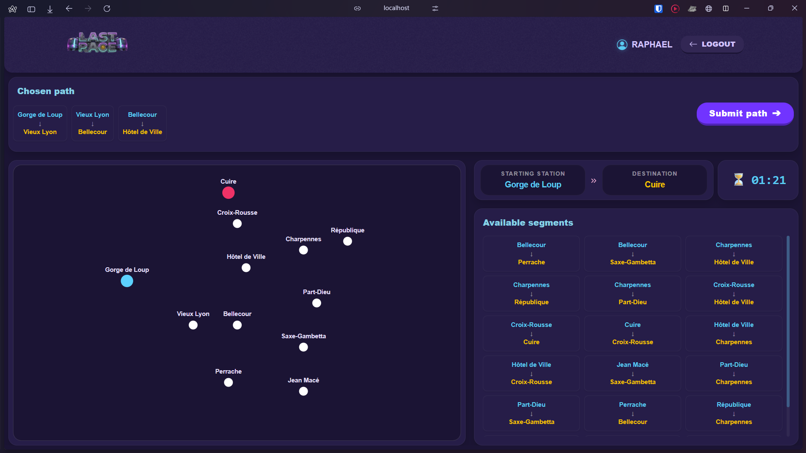

# Exam #1: "Last Race" - Underground Network Game
## Student: s362538 PUTON Nicolas 

## React Client Application Routes

### Public Routes
- **`/`** (LandingPage) — Landing page displaying game instructions and rules for anonymous users. Provides access to login for registered players.
- **`/login`** (LoginPage) — Authentication page with username and password form for user login.

### Protected Routes (Authentication Required)
- **`/home`** (HomePage) — Home page for authenticated users. Shows welcome message and buttons to launch a new game or view the leaderboard.
- **`/game`** (GamePage) — Main game interface. Manages all four game phases (Setup, Planning, Execution, Result) dynamically without page reloads. Displays the metro network map, timer, segment selection, and event execution.
- **`/leaderboard`** (LeaderboardPage) — General ranking page displaying the best scores from all registered users with the current user's rank highlighted.

### Error Handling
- **`*`** (ErrorPage) — Catch-all route. Displays a friendly "404 Not Found" error page for invalid URLs.

## Server-Side HTTP APIs

### Authentication Endpoints

**POST `/api/sessions`** — User login and session creation
- **Request Body:** `{ "username": "player1", "password": "password" }`
- **Response (201):** `{ "id": 1, "username": "player1", "bestScore": 25 }`
- **Status Codes:** `201 Created`, `401 Unauthorized`

**GET `/api/sessions/current`** — Check current user session
- **Request:** No parameters required
- **Response (200):** `{ "id": 1, "username": "player1", "bestScore": 25 }` or `null` if not authenticated
- **Status Codes:** `200 OK`

**DELETE `/api/sessions/current`** — User logout
- **Request:** No parameters required  
- **Response:** Empty body
- **Status Codes:** `200 OK`

### Game Endpoints

**GET `/api/game/setup`** — Retrieve network map and random start/destination stations
- **Query Parameters:** `sendMap=true` (optional, to include network data)
- **Response (200):**
  ```json
  {
    "network": {
      "stations": [{"id": 1, "name": "Charpennes", "x": 100, "y": 150}, ...],
      "lines": [{"id": 1, "name": "Red Line", "color": "#FF0000"}, ...],
      "segments": [{"id": 1, "station1Id": 1, "station2Id": 2, "lineId": 1}, ...]
    },
    "startStation": {"id": 1, "name": "Charpennes"},
    "endStation": {"id": 7, "name": "Saxe-Gambetta"}
  }
  ```
- **Status Codes:** `200 OK`, `401 Unauthorized`, `500 Internal Server Error`

**POST `/api/game/submit`** — Submit route and receive validation with event results
- **Request Body:** `{ "route": [1, 2, 3, 7] }` (array of station IDs)
- **Response (200):**
  ```json
  {
    "isValid": true,
    "finalScore": 23,
    "journeySteps": [
      {"step": 1, "fromStationId": 1, "toStationId": 2, "eventDescription": "Kind passenger", "effect": 1, "currentCoins": 21},
      {"step": 2, "fromStationId": 2, "toStationId": 3, "eventDescription": "Train delay", "effect": -2, "currentCoins": 19}
    ],
    "isNewRecord": true
  }
  ```
- **Status Codes:** `200 OK`, `400 Bad Request`, `401 Unauthorized`, `500 Internal Server Error`

### Leaderboard Endpoint

**GET `/api/leaderboard`** — Retrieve top players and current user's rank
- **Query Parameters:** `nbTop=10` (optional, default 10 top players)
- **Response (200):**
  ```json
  {
    "leaderboard": [
      {"username": "alice", "bestScore": 32},
      {"username": "bob", "bestScore": 28},
      {"username": "charlie", "bestScore": 25}
    ],
    "currentUserRank": 4
  }
  ```
- **Status Codes:** `200 OK`, `401 Unauthorized`, `500 Internal Server Error`

## Database Schema

The application uses SQLite with the following tables:

| Table | Columns | Purpose |
|-------|---------|---------|
| **users** | `id` (PK), `username` (UNIQUE), `hash`, `salt`, `bestScore` | Stores registered user credentials (encrypted/salted passwords) and best game score |
| **lines** | `id` (PK), `name`, `color` | Metro lines within the network |
| **stations** | `id` (PK), `name`, `x`, `y` | Stations on the metro network with coordinates for map rendering |
| **segments** | `id` (PK), `station1Id` (FK), `station2Id` (FK), `lineId` (FK) | Connections between stations on specific metro lines |
| **events** | `id` (PK), `description`, `effect` | Random events that occur during journey execution (effects range from -4 to +4) |

**Initial Data Requirements:**
- At least 4 metro lines ✅
- At least 12 stations ✅
- At least 3 interchange stations (stations on multiple lines) ✅
- At least 8 different random events ✅
- At least 3 registered users (2 with existing game history) ✅

## Main React Components

### Layout & Pages
- **`App`** (in `App.jsx`) — Root component managing all routes and user context
- **`MainLayout`** — Main layout wrapper with header and navigation bar
- **`LandingPage`** — Public landing page with game rules and instructions for anonymous users
- **`HomePage`** — Welcome page for authenticated users with buttons to start new game or view leaderboard
- **`GamePage`** — Main game interface managing all 4 game phases (Setup, Planning, Execution, Result)
- **`LeaderboardPage`** — Displays user rankings with current user highlighted
- **`LoginPage`** — Authentication form with username/password inputs
- **`ErrorPage`** — 404 error page

### Game Components  
- **`MapRenderer`** — Renders the metro network visualization with stations and lines
- **`Stations`** — Displays current start and destination stations
- **`Timer`** — 90-second countdown timer for the planning phase with danger warning
- **`SegmentList`** — Lists all available metro segments (pairs of connected stations)
- **`ChosenPath`** — Displays the user's selected route segments with ability to remove segments
- **`Events`** — Modal showing journey execution with event outcomes and coin changes
- **`GameResultPopup`** — Displays final game result (victory/defeat) with score and record status

### Navigation & Auth
- **`Header`** — Navigation header with user profile and logout button
- **`ProtectedRoute`** — Route guard component ensuring only authenticated users can access protected pages
- **`UserProvider`** — Context provider for managing global user authentication state

### Utility Components
- **`SmallCard`** — Displays individual station segments in the path
- **`ChosenPath`** — Route segment visualization container

## Test User Credentials

The following user accounts are pre-loaded in the database for testing:

| Username | Password | Best Score | Notes |
|----------|----------|-----------|-------|
| Marc | iLovecats2 | 24 | Top player with existing game history |
| Nicolo | 1l#jf3] | 23 | Mid-tier player with game history |
| Raphael | paris | 15 | Mid-tier player with game history  |

All other users (Bastien, Lucie, Sophie, Louis, Hugo) have 'test1234' as password.

**Note:** These credentials are seeded from `server/database/setup_db.js`, which is launch on first initialization of the server. 

## Application Screenshots

### Leaderboard Page
Displays the top 10 players globally with ranking icons (🥇🥈🥉) for top 3 players and numeric ranks for others. Current user's rank is highlighted in the leaderboard.

### Game Page - Planning Phase
Shows the metro network map with stations and lines. Players have 90 seconds (timer visible) to select a valid route from the start station (highlighted) to the destination station. Available segments are listed on the right side with ability to add/remove from chosen path.


## Use of AI Tools

Throughout development of this application, AI tools (GitHub Copilot) were used for:

- **Code Refactoring** — Unified CSS styling with centralized variables, removed duplicate components, CSS animations
- **Code generation** — CSS sheets, help with graphs algorithms
- **Assets generation** — Creation of images, svg, logos used for the design
- **Bug Fixes** — Resolved ESLint errors, fixed invalid CSS functions
- **Testing & Debugging** — Verified syntax correctness, validated API request/response structures, and debugged client-server communication
- **Documentation** — Generated and refined this README.md file
- **Logic Verification** — Confirmed game rules implementation (route validation, event application, score calculation) according to the exam guidelines.